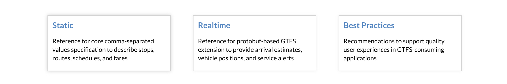
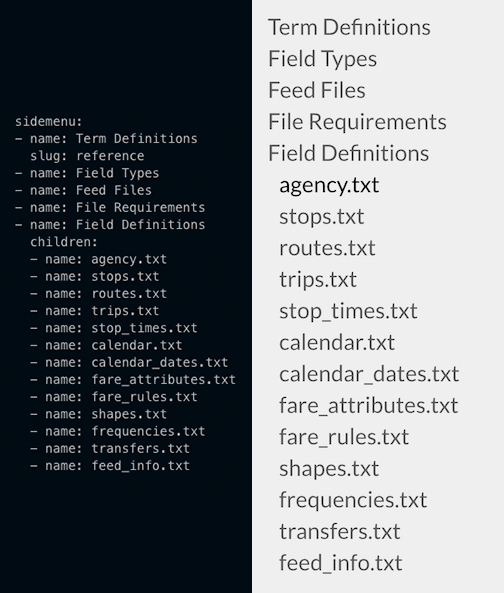

# gtfs.org
Source code for the [General Transit Feed Specification Site](https://gtfs.org). This site was built using [GatsbyJS](https://github.com/gatsbyjs/gatsby), a static-site generator which uses React and GraphQL.

## Editing site content
The content for this site is grouped into three primary categories: Core Reference, Realtime Reference and Best Practices. These categories are housed in separate repositories. To edit information in those documents, see the corresponding repository:

* [GTFS Core Reference](https://github.com/google/transit/tree/master/gtfs)
* [GTFS Realtime Reference](https://github.com/google/transit/tree/master/gtfs-realtime)
* [GTFS Best Practices](https://github.com/MobilityData/gtfs-best-practices)

## Building the site locally:
1. Clone this repository:
  `git clone https://github.com/MobilityData/gtfs.org`
2. Ensure you have up-to-date versions of node and npm installed locally.
3. Install dependencies:
  `npm install`
4. Run this command to clone all necessary data from the content repos:
  `npm run fetchdata`
5. To run the site locally in development mode:
  `npm run develop`
6. To build the production version and run it locally:
  `npm run build && npm run serve`

## Updating site structure using configs:
The individual pages of the site are programmatically generated from the markdown files in the `src/pages` directory. The files in `best-practices` and `reference` were cloned in step 4 above, the rest live in this repository. To update the content of the site simply update those files and commit them in their respective repository, this will automatically trigger a new build of the site.

The pages to be built and their respective source files are specified in `page-config.yaml` in the project root. If you'd like to add/remove pages, or update a reference page's navigation menu you can do so by making changes to this file.

Site navigation is also defined in this file. There are two sections of the header which contain the links defined as 'nav' and 'docs-nav'. Updating 'nav' will add new links to this bar:

Updating 'docs-nav' will add items to this menu: 



To add new pages, you must first create a new directory in `src/pages` containing the markdown files which will populate the page. Then register that directory to be queried into Gatsby's GraphQL data layer by appending an object of the following structure to the plugins array of `gatsby-config.js`:
```
    {
      resolve: "gatsby-source-filesystem",
      options: {
        path: `${__dirname}/src/pages/about`,
        name: "About"
      }
    },
```
 Replacing 'about' in path and name with the name of your directory and page, respectively. Then add a new section to `page-config.yaml` ensuring that the Title field matches the name field of the above object. 

In the page's config properties you will also specify the pages render template and a sidemenu with linked page sections. There are currently two page templates to use:

  1. `doc-page` is used for any documentation pages such as 'Best Practices' and 'Realtime Reference', requires a sidemenu and may be populated from numerous markdown files.

  2. `basic-page` is used for all other pages, can only be compiled from one markdown file, and doesn't have a sidemenu

 An example sidemenu and the resulting rendered component:



Because of differences in formatting between the existing source files there are a number of caveats to this config setup:

* Depending on the formatting of headers in your markdown files, the anchor links for the sidemenu may or may not be automatically generated when parsing the files. (i.e. the sidemenu config for Static Reference autogenerates, and thus only requires the 'name' field, which is what will be displayed in the sidemenu. However Realtime does not, so the anchors must be manually included in the config)

* Sidemenu items must correspond to headings in the markdown source files. They may each represent a separate file with that heading, or multiple headings from a single file.

* The sidemenu can only be nested to three levels of children, as in the Realtime Reference config.

* The slug field is used to specify source markdown files for a given page, and must be included for any sidemenu item that has a corresponding file. (i.e. Static and Realtime Reference are both compiled from one markdown file each, so they have only one slug at the root of the menu, whereas Best Practices has a file for each menu item and thus a slug is required for each)

## Data Layer
All of the data consumed by the site is queried using GraphQL. GraphQL nodes are created both automatically with a number of plugins (defined in gatsby-config.js) and manually as defined in gatsby-node.js. Gatsby comes with a convenient utility for building queries which can be found at http://localhost:8000/___graphql when running the site locally. Examples of the queries for the site's data can be located as follows:
* The query structure for navigation data is found in the header component. 
* Sidemenu and markdown content data is queried in the doc-page template component

Data from the content source markdown files is parsed by the 'gatsby-transformer-remark' plugin into an html tree structure known as htmlAst, which is then rendered using the 'rehype-react' compiler.

## Building and hosting
This site is built using [CircleCI](http://circleci.com) and hosted on Amazon S3 as a static site. Each time it is deployed, it pulls the latest documentation from [Google Transit](https://github.com/google/transit) and [GTFS Best Practices](https://github.com/MobilityData/gtfs-best-practices).

### Staging

Any commit pushed to the `master` branch will automatically be deployed to https://staging.gtfs.org. 

### Production 

Any commit pushed to the `production` branch will automatically be deployed to https://gtfs.org. 

## Planned features
* Search functionality - index all of the site content and add a search bar to the header for quickly finding reference information
* Localization - utilize a translation service to have all of the source markdown content translated, then incorporate a language selection component which will determine which language of the site will be served. A UI component already exists in the header component for this but is currently commented out
* The site is not currently optimized for mobile browsers

## Maintainability - Known Issues
* A sidemenu can currently only nest three levels, the side-nav component could be refactored to use recursion to remove any depth restriction
* Some of the content on the Best Practices page contains nested tables which are difficult to render from parsed markdown, the current solution is to use html tables within markdown tables, but these must not contain newline characters to remain valid markdown so they are difficult to read and update. This has been solved in the static and realtime reference pages by reformatting the content to not use nested tables.
* Because of the differences in filestructure between the source repos, and formatting differences within the markdown files living in those repos, the configuration of this site is more brittle and labor-intensive than it needs to be. Standardizing that structure and formatting would allow for a better workflow and much more flexibility in the configuration of this site.

## License

Except as otherwise noted, the content of this repository is licensed under the [Creative Commons Attribution 3.0 License](https://creativecommons.org/licenses/by/3.0/), and code samples are licensed under the [Apache 2.0 License](http://www.apache.org/licenses/LICENSE-2.0).
